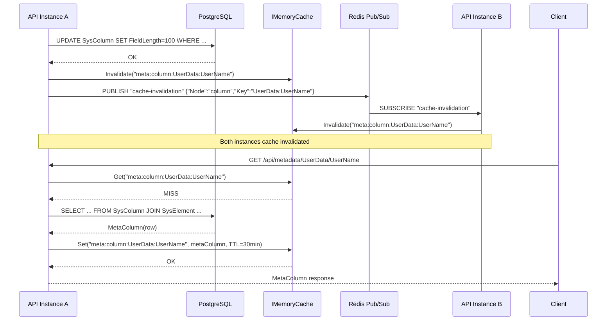
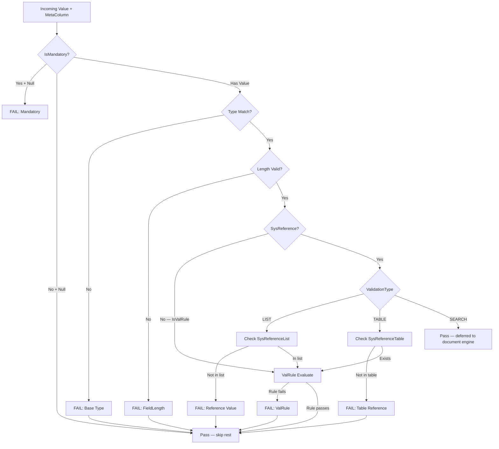
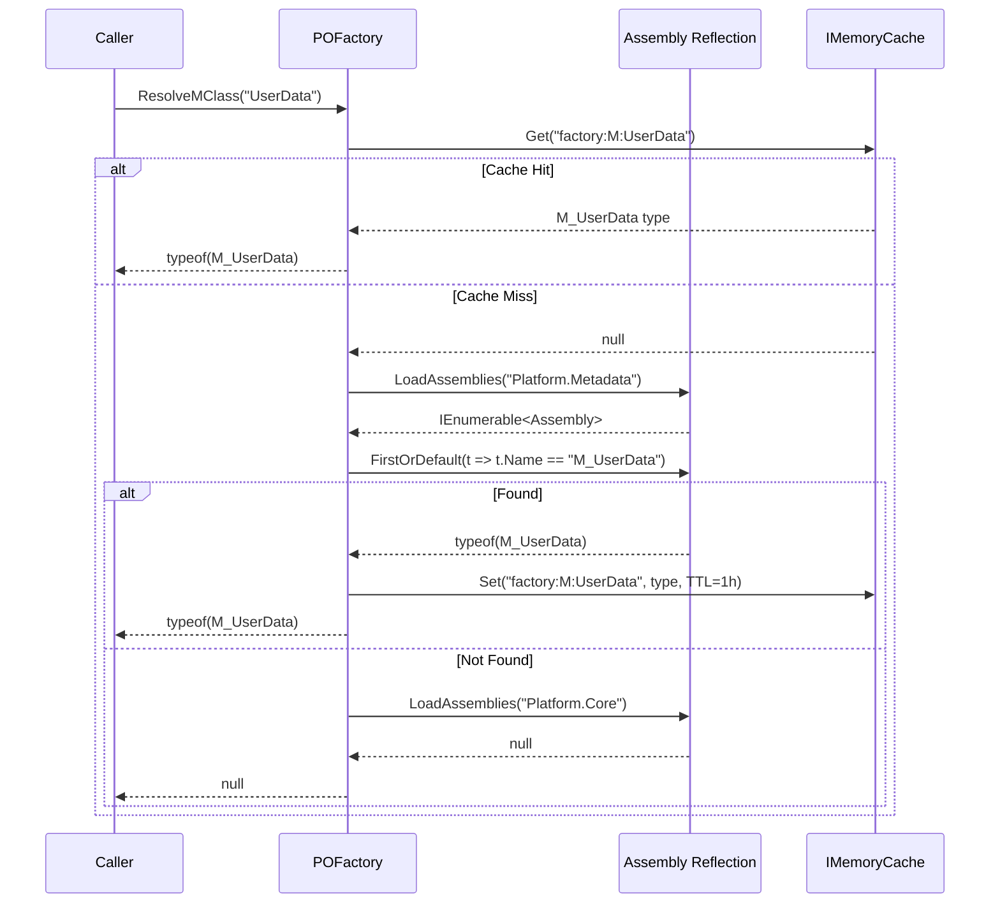

# Phase 2 — Metadata Runtime Design

## 1. Current Architecture (Phase 1)

Phase 1 established the dictionary foundation:

| Phase 1 Artifact | Purpose | Maps to Phase 2 |
|---|---|---|
| 8 dictionary tables | Persistent metadata store | Source data for runtime enrichment |
| 8 Dapper repositories | CRUD over dictionary tables | `IMetadataGraph` reads from these |
| Dapper TypeHandlers | Enum round-trip for PostgreSQL | Transparent to Phase 2 |
| IMemoryCache + Redis registered | Cache infrastructure | Used by metadata cache layer |
| 67 passing tests | CI-verified baseline | Regression tests for Phase 2 |

Phase 1 provides **static metadata storage**. Phase 2 builds the **runtime layer** that enriches, caches, validates, and exposes this metadata to business logic.

## 2. Required Phase 2 Components

### 2.1 Core Interfaces

```
IMetadataGraph          — Unified graph of all dictionary nodes
IMetadataCache          — Cache facade (local + distributed)
IMetadataCacheProvider  — Provider abstraction (MemoryCache / Redis)
IPersistentObject       — Marker for PO-generated types
IPOLifecycleHooks       — Interface for PO lifecycle callbacks
IValRuleEngine          — Dynamic rule evaluator
ITypeValidator          — Base type + length validation
IReferenceValueValidator — Reference membership validation
IContextVariableResolver — Runtime context variable substitution
IPOFactory              — Resolves table name → M_/X_ class
ICacheInvalidationService — Publishes DictionaryChangedEvent
IMetaColumn             — Enriched column metadata (extends SysColumn)
```

### 2.2 Runtime Classes

```
MetadataGraph           — Implementation of IMetadataGraph
MetaColumn              — Enriched view: SysColumn + SysElement(label/help) + SysReference + SysValRule
TypeValidator           — Validates VALUE against base type (Guid, Int64, String, Decimal, DateTime, TimeOnly, DateOnly, Boolean) + FieldLength
ReferenceValueValidator — Validates VALUE against allowed set from SysReference/SysReferenceList
ValRuleEngine           — Evaluates SysValRule.Code with sandboxing
ContextVariableResolver — Resolves $UserId, $TenantId, $OrgId, $Timestamp, $Value, etc.
PersistentObjectBase    — Base class with virtual lifecycle hook methods
POValidator             — Orchestrates validation pipeline
POFactory               — Resolves table name → M_<Table> or X_<Table> class via reflection
DictionaryChangedEvent  — Domain event: { EntityType, EntityId, ChangeType }
CacheInvalidationService — Publishes DictionaryChangedEvent, invalidates cache
CacheRefreshService     — Background refresh for stale metadata
```

### 2.3 Responsibilities

| Component | Assembly | Depends On |
|---|---|---|
| MetaColumn | Platform.Core | SysColumn, SysElement, SysReference, SysValRule models |
| MetadataGraph | Platform.Core | ISysTableRepository, ISysColumnRepository, ISysElementRepository, ISysReferenceRepository, ISysValRuleRepository |
| IMetadataCache | Platform.Core | IMemoryCache, IDistributedCache (both already registered in DI) |
| TypeValidator | Platform.Core | — |
| ReferenceValueValidator | Platform.Core | ISysReferenceRepository, ISysReferenceTableRepository |
| ValRuleEngine | Platform.Core | ISysValRuleRepository |
| ContextVariableResolver | Platform.Core | — |
| POValidator | Platform.Core | ITypeValidator, IReferenceValueValidator, IValRuleEngine, IContextVariableResolver |
| POFactory | Platform.Metadata | System.Reflection |
| DictionaryChangedEvent | Platform.Core | — |
| CacheInvalidationService | Platform.Core | IMetadataCache, ICacheProvider (Redis pub/sub) |
| CacheRefreshService | Platform.Core | IMetadataCache, IRepository<T> |

## 3. Interfaces

### IMetadataGraph

```csharp
public interface IMetadataGraph
{
    MetaColumn? GetColumn(string tableName, string columnName);
    IReadOnlyList<MetaColumn> GetColumns(string tableName);
    IReadOnlyList<string> GetTableNames();
    IReadOnlyList<MetaColumn> GetAllColumns();
    SysTable? GetTable(string tableName);
    IReadOnlyList<SysReference> GetReferences(string referenceName);
    IReadOnlyList<SysReferenceList> GetReferenceValues(string referenceName);
    ITopologicalSortResult TopologicalSort();
    event EventHandler<DictionaryChangedEventArgs>? DictionaryChanged;
}
```

### IMetadataCache

```csharp
public interface IMetadataCache
{
    T? Get<T>(string key);
    void Set<T>(string key, T value, TimeSpan? ttl = null);
    void Invalidate(string key);
    void InvalidateTable(string tableName);
    Task<bool> TryGetValue<T>(string key, out T? value);
    IReadOnlyCollection<string> GetAllKeys();
}
```

### IValRuleEngine

```csharp
public interface IValRuleEngine
{
    ValRuleResult Evaluate(SysValRule rule, object? value, IReadOnlyContext variables);
    IReadOnlyList<ValRuleResult> EvaluateBatch(string tableName, object? value, IReadOnlyContext variables);
}
```

### ITypeValidator

```csharp
public interface ITypeValidator
{
    ValidationResult Validate(string columnName, object? value, int? fieldLength, string baseType);
}
```

### IReferenceValueValidator

```csharp
public interface IReferenceValueValidator
{
    ValidationResult Validate(string columnName, object? value, int sysReferenceId, string validationType);
}
```

### IContextVariableResolver

```csharp
public interface IContextVariableResolver
{
    IReadOnlyContext GetCurrentContext();
    T Resolve<T>(string expression, IReadOnlyContext context);
    string ResolveString(string expression, IReadOnlyContext context);
}
```

### IPOFactory

```csharp
public interface IPOFactory
{
    Type? ResolveMClass(string tableName);     // M_UserData, M_OrderData, etc.
    Type? ResolveXClass(string tableName);     // X_UserData, X_OrderData, etc.
    object? CreateInstance(string tableName);  // Activator.CreateInstance
    IReadOnlyList<string> GetRegisteredTables();
}
```

### IPOLifecycleHooks

```csharp
public interface IPOLifecycleHooks
{
    Task<HookResult> BeforeCreateAsync(object po, IReadOnlyContext context);
    Task<HookResult> AfterCreateAsync(object po, IReadOnlyContext context);
    Task<HookResult> BeforeUpdateAsync(object po, IReadOnlyDictionary<string, object?> changes, IReadOnlyContext context);
    Task<HookResult> AfterUpdateAsync(object po, IReadOnlyDictionary<string, object?> changes, IReadOnlyContext context);
    Task<HookResult> BeforeDeleteAsync(object po, IReadOnlyContext context);
    Task<HookResult> AfterDeleteAsync(object po, IReadOnlyContext context);
    Task<HookResult> OnLoadAsync(object po, IReadOnlyContext context);
}
```

### ICacheInvalidationService

```csharp
public interface ICacheInvalidationService
{
    Task InvalidateAsync(DictionaryChangedEvent @event);
    Task InvalidateTableAsync(string tableName);
    Task InvalidateNodeAsync(string nodeType, string nodeKey);
}
```

## 4. Dependency Graph

```
Platform.Core
  ├── Metadata/                   (models, interfaces)
  ├── Runtime/                    (validators, engines, factories)
  └── Cache/                      (cache service, invalidation)

Platform.Data
  ├── Repositories/               (8 dictionary repos — Phase 1)
  └── Migrations/                 (unchanged — no new migrations)

Platform.Metadata               (NEW assembly)
  ├── POBase/                     (PersistentObjectBase, lifecycle hooks)
  ├── Factory/                    (POFactory — reflection-based)
  └── Generated/                  (X_<Table> — disposable, not hand-edited)

Platform.API
  └── Program.cs                  (register Phase 2 services, DI wiring)

Dependency direction:
  Platform.API → Platform.Metadata → Platform.Core ← Platform.Data
```

**Key dependency rules:**
- Platform.Core depends on NO other project (models + interfaces + validators use repository interfaces)
- Platform.Data implements repository interfaces but is NOT depended on by Platform.Core at runtime
- Platform.Metadata depends on Platform.Core (PO base classes use metadata models)
- Platform.API wires everything together

## 5. Cache Design

### 5.1 Three-Layer Cache

```
Layer 1: IMemoryCache        — Per-process, <5ms read, process-local
Layer 2: Redis                — Distributed, <1ms read, shared across instances
Layer 3: PostgreSQL           — Source of truth, read via Dapper
```

### 5.2 Cache Keys

```
Key pattern: "meta:{entityType}:{entityKey}"

Examples:
  meta:table:UserData
  meta:column:UserData:UserName
  meta:reference:DataType
  meta:referenceValues:DataType
  meta:valrule:UserData:EmailRule
  meta:tableMetadata:UserData      — Full table metadata (columns, validation rules)
```

**Key strategy:** SHA-256 hash of the query predicate for dynamic lookups.
Example: `meta:column:SHA256(UserData+IsActive=true)`

### 5.3 TTL Policy

| Cache Entry | TTL | Policy |
|---|---|---|
| Table metadata | 30 minutes absolute | Long-lived, rarely changes |
| Column metadata | 30 minutes absolute | Tied to table TTL |
| Reference values | 1 hour absolute | Static reference data |
| ValRule definitions | 30 minutes absolute | Rules change rarely |
| Full graph snapshot | 15 minutes absolute | Used for topological sort |

### 5.4 Cache Refresh Strategy

**On-demand (lazy):** First request for a key misses cache → loads from DB → populates cache.

**Pre-emptive (background):** `CacheRefreshService` runs a background worker that checks TTL and refreshes entries 5 minutes before expiry.

**Invalidation (event-driven):** `DictionaryChangedEvent` published after metadata write → invalidates affected keys → next read re-populates from DB.

### 5.5 Cache Invalidation Algorithm

```
DictionaryChanged(EntityType=Column, EntityId=42, ChangeType=Updated)
  ↓
1. Load affected SysColumn row → get TableName
2. Invalidate:
   - meta:column:{TableName}:{ColumnName}
   - meta:tableMetadata:{TableName}
   - meta:column:SHA256({TableName}:IsActive=true)  (any predicate on this table)
3. Publish to Redis pub/sub channel "cache-invalidation"
4. All processes subscribe → each invalidates local IMemoryCache
5. Mark Redis entry as stale (don't delete — allow in-flight reads to complete)
```

## 6. Cache Invalidation Sequence (Mermaid)



## 7. Validation Pipeline (Mermaid)



**Pipeline ordering (non-negotiable):**
1. Mandatory (null check)
2. Base type (Guid, Int64, String, Decimal, DateTime, TimeOnly, DateOnly, Boolean)
3. FieldLength (string length)
4. ValueMin/ValueMax (numeric/datetime range)
5. Base SysReference (LIST — from SysReferenceList)
6. Table Reference (TABLE — from SysReferenceTable)
7. ValRule (Code expression — custom logic)
8. BusinessRule (deferred to M_<Table> / document engine)

Each stage collects errors — the pipeline returns ALL failures, not just the first.

## 8. ValRule Execution Model

### 8.1 Rule Types

| RuleType | Code Format | Execution | Security Model |
|---|---|---|---|
| SIMPLE | `'VALUE IS NOT NULL'` | Parser → expression tree | Whitelist: IS, NOT, AND, OR, comparison operators only |
| REGEX | `'^[a-zA-Z0-9._%+-]+@[a-zA-Z0-9.-]+\.[a-zA-Z]{2,}$'` | System.Text.RegularExpressions | No options (no Singleline/ExplicitCompile), no backreference depth limit (default 100ms timeout) |
| SQL | `'SELECT COUNT(*) FROM allowed_emails WHERE email = @Value'` | Dapper parameterized SELECT | Parameterized ONLY. @Value injected as parameter. NO string concatenation. Whitelist functions: COUNT, SUM, AVG, MAX, MIN, EXISTS, CASE |
| LAMBDA | Compiled DLL in Platform.Metadata | Reflection + dynamic method | Sandboxed: no file I/O, no network, no P/Invoke, 5-second timeout |
| SCRIPT | Not supported in Phase 2 | — | Deferred to Phase 5+ (requires script host) |

### 8.2 SQL ValRule Sandboxing

```
ALLOWED:
  SELECT COUNT(*) FROM SomeTable WHERE Column = @Value
  SELECT EXISTS (SELECT 1 FROM ... WHERE ...)
  SELECT MAX(Column) FROM ... WHERE Other = @Value

FORBIDDEN:
  INSERT, UPDATE, DELETE, DROP, ALTER, TRUNCATE — rejected at parse stage
  String concatenation in Code — detected by regex check for unparameterized identifiers
  Subqueries referencing non-whitelisted tables — checked against dictionary metadata
```

**Implementation:** `ValRuleEngine` parses Code, extracts table names, verifies all referenced tables exist in dictionary metadata, rewrites queries to use `@Value` parameter for the value being validated.

### 8.3 Lambda ValRule Sandboxing

Lambda rules are compiled from pre-registered delegates, NOT from user-entered code. The delegate is registered at application startup via configuration:

```csharp
// Registered at startup — user cannot inject arbitrary code at runtime
ValRuleEngine.RegisterLambda("IsBusinessDay", (value, ctx) =>
    day => day.DayOfWeek is not DayOfWeek.Saturday and not DayOfWeek.Sunday);
```

## 9. Context Model

### 9.1 Reserved Context Variables

| Variable | Type | Source | Example |
|---|---|---|---|
| `$UserId` | string | HTTP Authorization header → JWT claim → DB lookup | `"usr-abc123"` |
| `$TenantId` | string | Multi-tenancy middleware / JWT claim | `"tenant-001"` |
| `$OrgId` | string | HTTP header X-Org-Id or JWT claim | `"org-456"` |
| `$Timestamp` | DateTime | DateTime.UtcNow | `2026-08-15T10:30:00Z` |
| `$Value` | object | The value being validated | `"test@example.com"` |
| `$ExistingValue` | object | For beforeUpdate hooks — original value | `"old@example.com"` |
| `$ParentTenantId` | string? | For nested entity hierarchies | `"tenant-002"` |
| `$ParentOrgId` | string? | For nested entity hierarchies | `"org-789"` |

### 9.2 Context Propagation

```csharp
// Context flows through:
// HTTP Request → API Controller → POFactory.Create() → POValidator.Validate() → ValRuleEngine.Evaluate()
// Each stage receives and passes forward the same IReadOnlyContext instance

public interface IReadOnlyContext
{
    string? UserId { get; }
    string? TenantId { get; }
    string? OrgId { get; }
    DateTime Timestamp { get; }
    object? Value { get; }
    object? ExistingValue { get; }
    IReadOnlyDictionary<string, object?> Extensions { get; }
}
```

## 10. PO Lifecycle (Mermaid)

```mermaid
stateDiagram-v2
    [*] → Create: Create(value)

    state Create {
        [*] → BeforeCreate: POValidator calls beforeCreate
        BeforeCreate → Validate: Hook passes
        BeforeCreate → Abort: Hook returns veto (FAIL)

        Validate → AfterCreate: All validations pass
        Validate → Abort: Validation fails (FAIL)

        AfterCreate → Persist: Hook passes
        AfterCreate → Abort: Hook returns veto (FAIL)

        Persist → [*]: INSERT to DB, publish DictionaryChangedEvent
    }

    state Update {
        [*] → BeforeUpdate: POValidator calls beforeUpdate
        BeforeUpdate → ValidateChanges: Hook passes
        BeforeUpdate → Abort: Hook returns veto (FAIL)

        ValidateChanges → AfterUpdate: Changes valid
        ValidateChanges → Abort: Validation fails (FAIL)

        AfterUpdate → Persist: Hook passes
        AfterUpdate → Abort: Hook returns veto (FAIL)

        Persist → [*]: UPDATE to DB, publish DictionaryChangedEvent
    }

    state Delete {
        [*] → BeforeDelete: POValidator calls beforeDelete
        BeforeDelete → Remove: Hook passes
        BeforeDelete → Abort: Hook returns veto (FAIL)

        Remove → [*]: DELETE from DB, publish DictionaryChangedEvent
    }

    Create → Abort: [any failure]
    Update → Abort: [any failure]
    Delete → Abort: [any failure]
    Abort → [*]
```



**Lifecycle hook execution order:**

1. `beforeCreate` — veto only (return FAIL to abort)
2. Validation pipeline — mandatory, type, reference, valRule
3. `afterCreate` — side effects only (log, notify, update aggregates)
4. `beforeUpdate` — veto
5. Change validation — only modified columns validated
6. `afterUpdate` — side effects
7. `beforeDelete` — veto (check for dependent records)
8. `afterDelete` — cleanup

## 11. Factory Resolution Flow (Mermaid)



**Resolution order:**
1. Check cache: `factory:M:{tableName}`
2. Search `Platform.Metadata` assembly for class named `M_{TableName}`
3. Fallback: return null (caller decides — could use X_<Table> or throw)
4. Cache result (found or not) for 1 hour

**Generated code (X_<Table>):**
- Generated code is in `Platform.Metadata.Generated/` directory
- Generated files are disposable — never hand-edit
- POFactory prefers M_<Table> (handwritten business logic) over X_<Table> (generated accessors)
- If M_<Table> doesn't exist, falls back to X_<Table>

## 12. Security Model

### 12.1 Threat Surface

| Component | Threat | Mitigation |
|---|---|---|
| ValRule SQL | SQL injection via Code column | Parameterized ONLY. Parse + reject non-SELECT. Whitelist tables. |
| ValRule Lambda | Arbitrary code execution | Pre-registered delegates only. No runtime user code. Timeout enforced. |
| POFactory class resolution | Arbitrary class instantiation | Assembly whitelist (Platform.Metadata only). No random Assembly.Load. |
| Cache poisoning | Malicious metadata via cache | Cache always refreshed from DB on DictionaryChanged. No untrusted write to cache. |
| Context variable injection | Tenant isolation bypass | Context set server-side from authenticated identity. Context is IReadOnly. |
| Dynamic SQL (future) | QueryBuilder injection | Identifiers from trusted metadata only. Values always parameterized. |

### 12.2 Multi-Tenancy

**Tenant predicate:** Every INSERT/UPDATE/DELETE on business data MUST include `TenantId` in the WHERE clause. This is enforced by the repository pattern — M_<Table> methods accept TenantId and inject it into predicates.

**Organization predicate:** Similar to TenantId, but scoped within a tenant. `OrgId` injected where required by business rules.

**Dictionary data:** Dictionary tables (SysColumn, SysTable, etc.) are typically shared across tenants. Organization-specific dictionary entries use a separate OrgId column (see Phase 4 design).

### 12.3 Authorization

**Dictionary read access:** Unauthenticated metadata reads are allowed (needed for form rendering). Dictionary writes require `admin` role.

**Business data access:** Authenticated. JWT token → user identity → tenant/org predicates applied server-side. UI role checks are NOT security boundary.

## 13. Concurrency Model

### 13.1 Metadata Writes (Dictionary)

**Problem:** Two admin users updating SysColumn simultaneously.

**Solution:** Optimistic concurrency on dictionary tables:

```sql
ALTER TABLE "SysColumn" ADD COLUMN "RowVersion" ROWVERSION;
-- OR use explicit integer:
ALTER TABLE "SysColumn" ADD COLUMN "Version" INT DEFAULT 0;
```

**Flow:**
```
UPDATE SysColumn SET FieldLength=100, Version=Version+1
WHERE SysColumn_ID=42 AND Version=5
→ If 0 rows affected → ConflictException thrown
```

### 13.2 Business Data (PO Layer)

**Problem:** Two requests updating the same business record.

**Solution:** Optimistic concurrency via M_<Table> methods. Each M_<Table> includes Version check in UPDATE WHERE clause.

### 13.3 Cache Concurrency

- IMemoryCache is thread-safe (concurrent dictionary internally)
- Redis operations are async/await — no blocking
- DictionaryChangedEvent pub/sub is fire-and-forget — a stale read is acceptable

## 14. Performance Considerations

### 14.1 Target Metrics

| Operation | Target | Measurement |
|---|---|---|
| Metadata graph construction | <100ms (cold start) | Stopwatch on first request |
| Cache hit read | <1ms | IMemoryCache.GetTimestamp |
| Redis read | <2ms | Redis latency monitoring |
| DB fallback (cache miss) | <10ms (single row) | Dapper QueryFirstOrDefault |
| Full validation pipeline | <5ms per field | Stopwatch in POValidator |
| ValRule SQL evaluation | <50ms | CommandTimeout on Dapper |

### 14.2 Optimization Strategies

1. **Eager load on startup:** Pre-build MetadataGraph into cache during application startup (IHostedService).
2. **Topological sort cache:** Cache sort result for 15 minutes. Only needed during migration/seed.
3. **Column batch load:** Single query JOIN across SysColumn + SysElement + SysReference + SysValRule instead of N+1 queries.
4. **Connection pooling:** Npgsql default pool size (100) sufficient for metadata reads.
5. **No caching for ValRule SQL:** Each ValRule evaluation executes a DB query — acceptable because ValRules are rare and results are cached in IMemoryCache per-evaluation if needed.

### 14.3 N+1 Prevention

```csharp
// BAD — N+1 query
foreach (var col in columns)
{
    var rules = await _valRuleRepo.GetByColumnIdAsync(col.SysColumn_ID);
}

// GOOD — single JOIN query
var allMeta = await _graph.LoadAllAsync();
// Returns List<MetaColumn> with all joins done in 1-2 queries
```

## 15. ADRs Required

### ADR-0001: Cache Key Strategy

**Context:** Need consistent key naming across local and distributed cache.
**Decision:** Use dot-notation keys: `meta:{type}:{key}`. SHA-256 hash for predicate-based lookups.
**Consequences:** Simple, human-readable keys. Hash collision probability negligible for <10K entries.
**Alternatives considered:** Hierarchical keys (`meta/table/UserData`), UUID keys (not debuggable).

### ADR-0002: ValRule Security Model

**Context:** Users enter SQL/Regex/Lambda in SysValRule.Code — must not execute arbitrary code.
**Decision:** Layered sandbox: SQL whitelist + Regex timeout + Lambda pre-registration.
**Consequences:** Prevents injection and arbitrary execution. Limits expressiveness — complex rules may need M_<Table> hooks instead.
**Alternatives considered:** Full SQL engine (too risky), script host (Phase 5+), Lambda-from-file (operational complexity).

### ADR-0003: Context Variable Source

**Context:** Where do $UserId, $TenantId, $OrgId come from?
**Decision:** Set from authenticated JWT claims at API entry point. Never from client input.
**Consequences:** Context is always trustworthy. If IdP changes, update claim mapping in one place.
**Alternatives considered:** Context from HTTP headers (vulnerable to header spoofing), context from DB lookup per-request (too slow).

### ADR-0004: PO Factory Resolution

**Context:** How to resolve "UserData" → "M_UserData" without reflection on every request?
**Decision:** Cache reflection results for 1 hour. Prefer M_<Table> over X_<Table>.
**Consequences:** First request after deploy has slight delay. Assembly changes require app restart.
**Alternatives considered:** Convention-based registration (more config), DI-based resolution (tight coupling).

### ADR-0005: Lambda Script Safety

**Context:** If ValRule supports user-defined expressions, how to prevent DoS?
**Decision (Phase 2):** No user-defined lambdas. Only pre-registered delegates at startup.
**Decision (Phase 5+):** Script host with CPU/time limits, evaluated in isolated Process or ThreadPool with quota.
**Consequences:** Phase 2 limits expressiveness. Phase 5 needs careful design.

## 16. Implementation Phasing (Within Phase 2)

### Sprint 2a — Core Runtime
1. MetaColumn enriched model
2. MetadataGraph (single-batch load, JOIN queries)
3. IMetadataCache facade
4. IMemoryCache + Redis integration

### Sprint 2b — Validation
5. TypeValidator (base types + FieldLength)
6. ReferenceValueValidator (LIST + TABLE)
7. ValRuleEngine (SIMPLE + REGEX + SQL — Lambda deferred)
8. ContextVariableResolver

### Sprint 2c — PO Layer
9. POValidator (pipeline orchestrator)
10. POFactory (reflection-based)
11. DictionaryChangedEvent + CacheInvalidationService
12. CacheRefreshService (background worker)

### Sprint 2d — Integration + Hardening
13. Topological sort
14. Inactive node exclusion
15. Performance optimization (batch loading)
16. End-to-end tests

## 17. Files to Create

```
src/Platform.Core/
  Metadata/
    MetaColumn.cs                    (new — enriched column model)
    IReadOnlyContext.cs              (new — context interface)
    ValRuleResult.cs                 (new — validation result)
    ValidationResult.cs              (existing? check, may need creation)
    DictionaryChangedEventArgs.cs    (new — event args)
  Runtime/                          (NEW directory)
    TypeValidator.cs                 (new)
    ReferenceValueValidator.cs       (new)
    ValRuleEngine.cs                 (new)
    ContextVariableResolver.cs       (new)
    POValidator.cs                   (new)
    MetadataGraph.cs                 (new)
  Cache/                            (NEW directory)
    MetadataCacheService.cs          (new)
    CacheInvalidationService.cs      (new)
    CacheRefreshService.cs           (new — IHostedService)

src/Platform.Metadata/              (NEW assembly)
  POBase/
    PersistentObjectBase.cs          (new — lifecycle hooks)
  Factory/
    POFactory.cs                     (new — reflection resolver)
  Generated/                        (empty — code generator outputs here)

tests/Platform.Tests.Runtime/       (NEW test project)
  MetaColumnTests.cs
  TypeValidatorTests.cs
  ReferenceValueValidatorTests.cs
  ValRuleEngineTests.cs
  ContextVariableResolverTests.cs
  POValidatorTests.cs
  POFactoryTests.cs
  MetadataGraphTests.cs
  CacheInvalidationTests.cs

docs/
  architecture/PHASE-2-METADATA-RUNTIME-DESIGN.md  (this file)
  security/PHASE-2-SECURITY-REVIEW.md              (new)
  testing/PHASE-2-TEST-MATRIX.md                   (new)
```

## 18. Files to Modify

```
src/Platform.API/Program.cs          — Register Phase 2 services in DI
src/Platform.Core/Platform.Core.csproj — No changes needed (all new files within existing project)
```

## 19. Database Changes

**None.** Phase 2 requires zero database migrations. All components operate on existing 8 dictionary tables. MetaColumn is a runtime composition of SysColumn rows joined with FK-linked tables (SysElement, SysReference, SysValRule).

## 20. Out of Scope for Phase 2

- Dynamic form generation (frontend — Phase 3)
- Document engine / workflow engine (HLD Section 31-33)
- Module loader (HLD Section 34)
- Expression parser (HLD Section 12 — deferred)
- Computed columns (HLD Section 13 — deferred)
- Organization-specific dictionary (Phase 4)
- Multi-tenant isolation at DB level (Phase 4)
- Script-based ValRules (Phase 5+)
- Generated code pipeline (separate tooling, Phase 3+)
